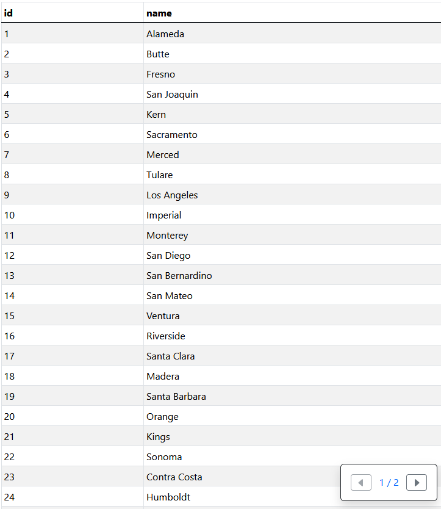
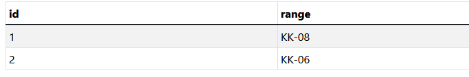
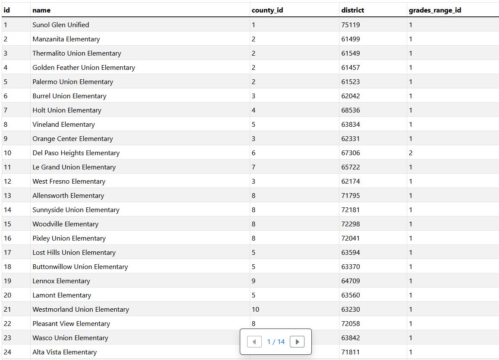
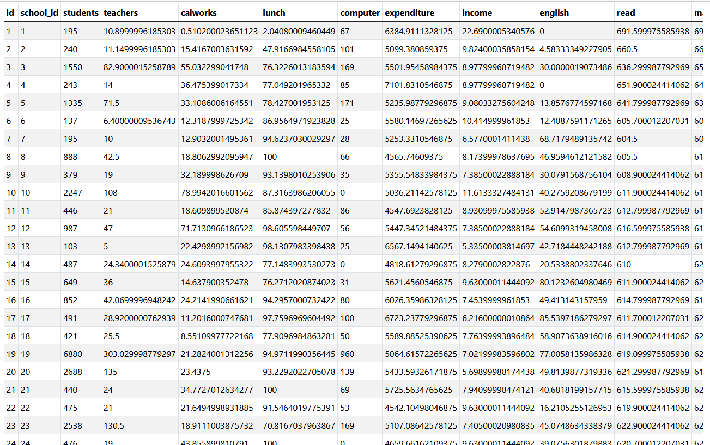

# Последовательность работы
Согласно таблице распределения вариантов мой вариант задания 2.

В файле CSV для данного проекта имеются следующие данные: номера района, название школы, название города, уровень образования и школьные метрики (students, teachers, calworks, lunch, computer, expenditure, income, english, read, math).
В отдельные таблицы были вынесены данные по уровню образования, названия школ, школьные метрики и название городов для более удобного взаимодействия с данными. 
Мы получили следующие таблицы: counties, grades_ranges, schools, school_metrics.

В таблице counties имеются следующие колонки: id, name.
Для взаимодействия с этой таблицей был создан класс County и репозиторий CountyRepository.

В таблице grades_ranges имеются следующие колонки: id, range.
Для взаимодействия с этой таблицей был создан класс GradesRange и репозиторий GradesRangeRepository.

В таблице schools имеются слеедующие колонки: id, name, county_id, district, grades_range_id.
Для взаимодействия с этой таблицей был создан класс School и репозиторий SchoolRepository.

В таблице school_metrics имеются следующие колонки: id, school_id, students, teachers, calworks, lunch, computer, expenditure, income, english, read, math.
Для взаимодействия с этой таблицей был создан класс SchoolMetrics. Так как эта сущность связана с сущностью School то и репозиторий у них один. 

Для обработки полученных данных используется класс DatabaseService. Данный класс используется для создания соединения с БД, а также создания объектов репозиториев. Если файла БД не существует, то класс создаст файл. Если не существует таблиц, то создаст таблицы. 

Из файла данные парсим при помощи класса CsvParser. Для этого используется библиотека opencsv CSVReader.

Для построения графика используется класс AvgStudentsByGraphBuilder с подключенной библиотекой JFreeChart. 

Согласно моему варианту задания для выполнения 1 задачи нужно построить график по среднему количеству студентов в 10 различных городах.

Для выполнения 2 задания необходимо вывести в консоль среднее кол-во расходов в городах: Fresno, Contra Costa, El Dorado и Glenn, где расход более 10. 
Соответственно выводим средние значения по каждому указанному городу в консоль.

Для 3 задания нужно вывести в консоль учебное заведение, с количеством студентов равному от 5000 до 7500 и с 10000 до 11000, с самым высоким показателем по математике (math).
